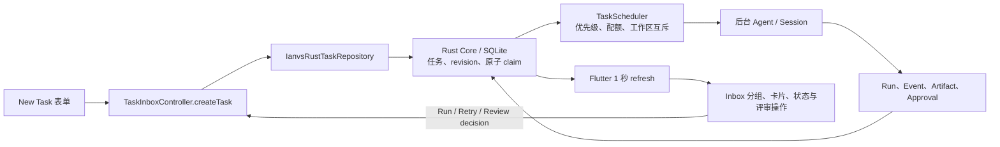

# Inbox 功能、数据流与交互评审

评审日期：2026-07-19
范围：macOS Flutter 客户端的 Inbox 空状态、任务创建、任务卡片、排队、失败重试、人工评审与持久化流转。
证据环境：800 × 640 的隔离调试构建；顶部红色 Agent 错误来自刻意配置的不可用测试 Agent，不属于 Inbox 缺陷。

## 结论

Inbox 的底层职责划分是可靠的：Flutter 负责输入与状态投影，`TaskInboxController` 串行化本地状态变更，Rust Core/SQLite 负责权威任务数据、revision 与原子 claim，`TaskScheduler` 负责调度、工作区互斥和运行生命周期。原实现的主要问题集中在“用户看不见系统已经知道的信息”：空状态没有入口、创建后的原始请求消失、状态缺少下一步解释、图标操作难以理解、排队任务仍允许重复 Run。

本轮已完成这些问题的实现与验证；当前主流程没有剩余 P0/P1/P2 级明确问题。

## 核心数据流

关键边界：

- 创建任务先写入 repository，再更新 controller 内存快照并通知 UI。
- `TaskScheduler` 不直接依赖视觉状态；它从权威任务记录执行排队和 drain。
- 排队任务的重复 enqueue 现在在 UI 和 scheduler 两层都被阻止；scheduler 仍会调度 drain，但不会重复写 revision。
- 后台运行产生的 run/event/artifact/approval 回写权威存储，再由前台定时刷新投影到 Inbox。
- 人工评审动作由 controller 串行执行；提交期间所有评审决策按钮禁用，避免双击造成竞争写入。

## 用户旅程与健康度

1. 进入 Inbox 空状态 — **通过**
   - 原问题：只有 “No tasks yet”，缺少用途说明和主要入口。
   - 优化：增加后台任务用途说明与 `Create task` 主按钮，同时保留标题栏快捷入口。
2. 创建任务 — **通过**
   - 原优点：工作区、Agent、优先级默认值合理，必填校验完整。
   - 优化：为标题、描述、工作区和自由输入 Agent 建立系统辅助功能分组标签；真实 macOS AX 树已验证。
3. 理解与启动任务 — **通过**
   - 原问题：创建后的 description 不显示，两个小图标的含义和可用性不清晰。
   - 优化：选中卡片显示原始请求、当前摘要和状态对应的下一步；操作改为 `Run task` / `Retry` / `Open session` 文本按钮，只展示可执行动作。
4. 等待后台调度 — **通过**
   - 原问题：Queued 任务仍显示 Run，重复点击会再次写入 queued 状态并改变 revision。
   - 优化：Queued 卡片明确说明会自动开始，不再显示 Run；scheduler 的 enqueue 同时变为幂等。
5. 失败与阻塞恢复 — **通过**
   - 原问题：`task.error` 没有在卡片中呈现，用户只能看到模糊状态。
   - 优化：选中失败任务显示错误信息、恢复建议与 `Retry`；权限、认证和用户输入阻塞分别给出下一步。
6. 人工评审 — **通过**
   - 原优点：已有 artifact 预览和 Mark Done / Request Changes / Reject 决策。
   - 优化：保存决策时显示 `Saving decision…` 并禁用全部决策按钮，防止重复提交。

## 基线发现与处置

| 严重度 | 发现 | 影响 | 处置 |
|---|---|---|---|
| P1 | 空状态没有可见创建入口 | 新用户难以发现 Inbox 的核心任务 | 已增加说明与 CTA |
| P1 | Queued 任务仍可 Run | 重复持久化、revision 变化、队列顺序抖动风险 | UI 禁止 + scheduler 幂等 |
| P1 | 创建后隐藏 description | 用户无法确认 Agent 实际收到的目标 | 选中任务显示原始请求 |
| P1 | macOS 辅助功能树中的输入框未命名 | VoiceOver 用户难以理解字段 | 增加语义容器并在系统 AX 树验证 |
| P2 | 28px 图标操作无文本且包含不可用操作 | 可发现性低，视觉噪声高 | 改为状态相关的文字按钮 |
| P2 | 失败原因不显示 | 用户无法判断是否值得重试 | 显示 error、说明与 Retry |
| P2 | 评审决策可并发触发 | 可能产生竞争写入与不明确反馈 | 加入每任务 busy 锁与提交反馈 |

## 视觉证据

- 空状态基线：[13-current-inbox-empty.png](13-current-inbox-empty.png)
- 空状态优化：[18-current-inbox-empty-improved.png](18-current-inbox-empty-improved.png)
- 创建任务表单：[19-current-new-task-accessible.png](19-current-new-task-accessible.png)
- 任务卡片优化：[20-current-task-created-improved.png](20-current-task-created-improved.png)
- Queued 状态优化：[21-current-task-queued-improved.png](21-current-task-queued-improved.png)
- 前后全屏对比：[qa-created-comparison.png](qa-created-comparison.png)
- 前后侧栏聚焦对比：[qa-sidebar-focused-comparison.png](qa-sidebar-focused-comparison.png)

## 验证

- Inbox 组件测试：22 项通过。
- Inbox、Controller、Scheduler、AppShell、AcpClientApp 最终联合回归：190 项通过。
- 最终 Flutter 静态分析：无问题。
- 真实 macOS AX 树：标题栏数据菜单、新建任务、空状态 CTA、表单字段分组和 Run 操作均有可读名称。
- 同一 800 × 640 视口完成空状态、创建后和 Queued 状态的前后合并对比；未发现溢出、裁切、异常换行或层级冲突。

## 评审边界与后续观察

- 本轮只评审原生桌面 Inbox；移动端 tap target、移动/平板响应式不适用于当前产品形态。
- 截图不能替代完整 VoiceOver 会话、键盘-only 走查或高倍文字缩放；已用 Flutter semantics 测试与 macOS AX 树覆盖关键标签，但这些仍适合作为发布前人工验收项。
- 当任务数量显著增加后，搜索、筛选、分组折叠和虚拟化可能成为下一阶段需求；当前样本规模下没有足够证据把它们列为缺陷。
