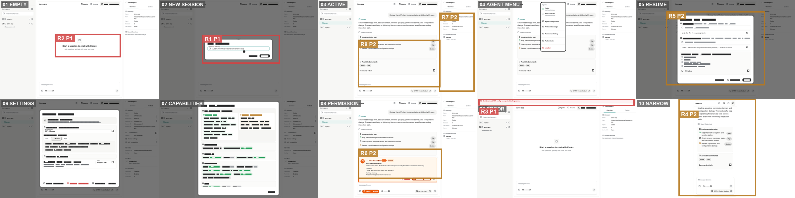

# ACP Client 全流程团队评审

日期：2026-08-09
评审对象：`01-full-flow-contact-sheet.png`（2400 × 600）
模式：产品体验 + 视觉设计 + 可访问性风险联合评审

## 评审范围与团队

用户目标是在 ACP Client 中完成从空工作区到建立会话、恢复会话、配置 Agent、查看能力、处理权限、理解错误并在窄窗口继续工作的完整任务。

本轮由三个独立 subagent 评审同一份截图证据：

1. 视觉设计：字体层级、密度、边框、阴影、色彩、对齐与跨状态一致性。
2. 产品体验与可访问性：任务发现、流程摩擦、错误恢复、权限决策、响应式功能保留和截图可见的可访问性风险。
3. Codex / ChatGPT 风格：方案 2 忠实度、三栏壳层、对话层级、Context inspector、composer 与组件系统一致性。

## 总体结论

**有条件通过，约 7.0 / 10（B-）。**

设计方向成立：暖白底色、低噪声边框、克制青绿色、稳定三栏、开放式对话区和底部 composer 已接近 Codex / ChatGPT。十个状态覆盖完整，390 px 窄窗口没有截图可见的横向裁切。

当前不建议把这份联系表作为最终字体与图标签收证据。三位评审一致发现多处文字呈黑/灰块、图标呈空心方框；必须先证明这是截图链路问题还是运行时缺陷，再重新生成可读联系表。

## 步骤健康度

| 步骤 | 状态 | 健康度 | 团队结论 |
|---|---|---|---|
| 1 | 空工作区 | 需改进 | 结构安静清楚，但中央“开始会话”没有对应的显式主按钮。 |
| 2 | 新建会话 | 基本健康 | 单字段聚焦明确；标题、按钮与图标证据失真，需重拍。 |
| 3 | 活跃对话 | 健康 | 消息顺序清楚、composer 稳定；计划与命令仍稍偏后台卡片化。 |
| 4 | Agent 菜单 | 基本健康 | 信息分组合理；外框偏重且图标不可可靠判读。 |
| 5 | 恢复会话 | 高摩擦 | 信息完整但密度高，用户需要在确认前扫描大量元数据。 |
| 6 | 会话设置 | 基本健康 | 分组完整；嵌套容器多，和其他弹窗的规格不统一。 |
| 7 | 能力覆盖 | 需精修 | 状态分区可理解；卡片、胶囊和颜色同时竞争注意力。 |
| 8 | 权限请求 | 需精修 | 原因、命令、目录透明；警示面积和相邻决策控件偏强。 |
| 9 | 启动错误 | 不健康 | 错误可见且不遮挡界面，但缺少直接恢复动作。 |
| 10 | 390 px 窄窗口 | 需改进 | 内容没有横向裁切；导航与 Context 缺少明确替代入口。 |

## 标注意见

### R1 · P1 · 截图字体与图标证据失真

- 步骤：1–10，步骤 2、4–8 最明显。
- 坐标代表点：`(630, 132)`；标注框位于步骤 2。
- 团队共识：3 / 3。
- 可见证据：弹窗标题和说明出现连续黑/灰矩形；工具栏、菜单、输入框与折叠控件出现一致的空心方框。
- 影响：无法可靠评审真实字体、400/500/600 字重、中文回退、图标基线、按钮文案宽度和可识别性。
- 建议：先用真实构建确认是否复现；截图环境需加载生产字体各字重与 Material / icon font，并增加无 tofu glyph 的截图门禁，再重拍十张单图与联系表。

### R2 · P1 · 空态缺少显式主行动

- 步骤：1。
- 坐标：`x=165–365, y=102–174`。
- 可见证据：中央文案要求用户开始会话，附近没有 `New session` 或 `Start session` 按钮。
- 影响：首次用户看见目标，但需要猜测顶部动作或输入框是否会自动建会话。
- 建议：在空态说明下增加主按钮，并与顶部新建入口共用同一动作；禁用输入框时明确说明原因。

### R3 · P1 · 启动错误不可直接恢复

- 步骤：9。
- 坐标：`x=1444–1916, y=300–322`。
- 可见证据：顶部仅展示 `Could not load ACP config: unexpected trailing comma`，没有打开配置、重试或详情入口。
- 影响：用户知道失败原因，却无法在当前界面继续修复，形成任务死路。
- 建议：增加 `打开配置`、`重试`、`复制诊断`；展示错误文件及行列；修复后明确宣布恢复成功。

### R4 · P2 · 窄窗口发生功能性导航降级

- 步骤：10。
- 坐标：`x=2048–2283, y=300–595`。
- 团队共识：3 / 3，严重度意见介于 P1 与 P3，合并为 P2。
- 可见证据：三栏折为单列后，工作区、会话列表和 Context 不可见；顶部只剩无文字图标，composer 控件分为两行。
- 影响：阅读和输入仍可用，但切换任务、返回工作区和查看上下文的发现性下降。
- 建议：保留带可访问名称的导航入口；侧栏改为抽屉，Context 改为明确按钮或底部面板；核心命中区域至少约 44 × 44。

### R5 · P2 · 模态系统与恢复会话密度不统一

- 步骤：2、5–7，标注位于步骤 5。
- 坐标：`x=2010–2310, y=34–259`。
- 团队共识：3 / 3。
- 可见证据：新建会话使用小型弹窗，而恢复、设置、能力覆盖接近全屏工作面板；后者外框、阴影、元数据与嵌套分组更重。
- 影响：同一产品像存在多套模态语言，扫描与确认成本偏高。
- 建议：建立 small / medium / large 三档模态 token，统一圆角、1 px 中性描边、遮罩、标题和底部操作区；恢复列表优先展示会话名、Agent、相对时间，详情按需展开。

### R6 · P2 · 权限状态视觉过强且决策目标拥挤

- 步骤：8。
- 坐标：`x=1080–1335, y=450–542`。
- 团队共识：3 / 3。
- 可见证据：同一状态同时使用大面积橙色底、左轨、外框、图标、标签和多个相邻按钮；composer 再次重复橙色状态胶囊。
- 影响：风险足够醒目，但压过对话内容；高风险决策的相邻小控件可能增加误授权。
- 建议：保留窄橙色左轨、风险图标和一个推荐决策；卡面回到更浅的暖中性色，其他操作改为中性按钮；命中区域至少约 44 × 44，并清楚区分一次允许、持续允许和拒绝。

### R7 · P2 · 活跃会话默认 inspector 未突出 Context

- 步骤：3、8，标注位于步骤 3 右栏。
- 坐标：`x=1325–1433, y=38–278`。
- 可见证据：活跃会话默认显示 Overview，主要内容为 Directory 与 Recent Sessions；选定方案 2 的核心右栏是持续可见的 Agent、Additional Directories、MCP 和 Assistant Agent 上下文控制。
- 影响：三栏外形接近，但方案 2 最有辨识度的持续上下文体验不是默认工作面。
- 建议：有活跃会话时默认进入 Context，或将关键上下文状态前置到 Overview；两页使用一致行组件和信息层级。

### R8 · P2 · 主对话仍偏卡片式后台

- 步骤：3。
- 坐标：`x=1080–1330, y=120–265`。
- 可见证据：Implementation plan 与 Available Commands 使用两个大外框卡，占据主要阅读区域。
- 影响：阅读节奏被大块容器切碎，削弱对话优先的 Codex / ChatGPT 气质。
- 建议：普通计划和命令列表改为内联区块或更轻的分隔；边框卡只保留给 diff、权限、错误和可操作成果。

## 可保留的亮点

- 空态、活跃态和错误态保持稳定的工作区—对话—检查器骨架，位置记忆成本低。
- 暖白背景、细分隔线和青绿色选中态已经形成低噪声产品基调。
- 用户消息右对齐、Agent 正文左对齐，主阅读顺序自然。
- composer 在空态、活跃态和窄窗口中保持连续位置。
- 权限请求在决策前展示原因、完整命令和工作目录，信息透明度良好。
- 390 px 窄窗口完成单列重排，没有截图可见的横向裁切。
- 启动错误使用顶部横幅而非打断式弹窗，保留了界面上下文。

## 可访问性风险与证据限制

静态截图只能证明可见布局，不能证明 WCAG 或完整可访问性通过。仍需实测：

- Tab 顺序、焦点可见性、弹窗焦点陷阱、Escape 关闭及关闭后的焦点恢复。
- VoiceOver 的 name / role / value、标题层级、菜单选中态和状态变更播报。
- 权限请求与启动错误的 live-region 行为。
- 图标按钮的真实命中区域、键盘 Tooltip 与快捷键冲突。
- 精确颜色对比度、200% / 400% 缩放、系统大字体和中文长文案。
- 高对比模式、减少动态效果、深色模式、滚动与 hover / pressed 状态。

原始联系表与十张单图已保留；本轮没有修改产品实现。
