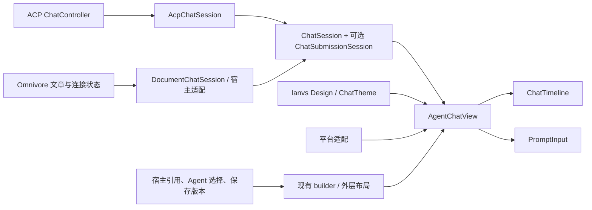

# ACP / Omnivore Agent 对话组件统一方案

> 状态更新：用户后续已要求完成实现并同步 Omnivore，本文的“本轮仅方案、未授权实施/发布”描述保留为前期协商记录，已被后续实施要求取代。实际发布授权与验证证据见 `agent-chat-release-0.2.0.md`。

日期：2026-09-23。状态：双方已完成代码调查、往返协商与文档交叉审阅，待按方案实施；本轮仅提交方案，不实施重构或发布包。

后续 Markdown 渲染版本的三方协商、公共内核边界与发布门槛见[Markdown 渲染版本协商](markdown-renderer-alignment-2026-09-23.md)。该补充继续遵守 Omnivore 全程使用 pub.dev 的约束。

ACP 分析基线为 `9be41c9`，工作树 `/Users/robinfai/.codex/worktrees/ffe1/ianvs-acp`。已只读对照主目录 `/Users/robinfai/flutter_projects/ianvs-acp`：未提交变化位于 `.gitignore`、Rust Cargo 及运行时测试，`lib` 与 `packages/ianvs_agent_chat` 无差异。项目内未发现额外 `AGENTS.md`，已读取生效的 `/Users/robinfai/.codex/AGENTS.md`。

Omnivore 侧由协调任务 `01a0cbe8-4b31-79f3-9408-95820503c855` 分析；其主目录有大量未提交改动，本方案参考的是现有文件内容，不假定其 HEAD 等于当前界面。ACP 本轮未运行测试；Omnivore 运行现有 `document_chat_session_test.dart` 与 `article_ai_panel_test.dart`，合计 7 项通过。它们是迁移前基线，不证明拟定 API 或两端视觉/原生验收已完成；下文区分代码事实和待实现验收。

## 1. 共同决策

两端默认采用同一个 `AgentChatView → ChatTimeline + PromptInput`。`ianvs_agent_chat` 负责对话呈现与交互，`ianvs_design` 提供视觉基础；宿主负责业务上下文和运行时。统一不是复制 ACP 应用壳，也不把 Omnivore 的文章模型放进聊天包。

第一阶段仅新增草稿控制器、可选提交接收契约和必要的平台适配，修正共享响应式布局、滚动跟随；现有 builder 足够承载引用、快捷操作、空态和保存入口。不新增第二套 composer，不改写 ACP 控制器、缓存或 Rust 运行时。



## 2. 已有复用能力与代码依据

以下路径均相对本仓库。

| 能力 | 当前实现与可复用边界 |
| --- | --- |
| 整体对话区 | `packages/ianvs_agent_chat/lib/agent_chat_view.dart:17`；监听 `ChatSession`，以 `state.identity` 给 timeline/composer 建 key，不销毁宿主 session。ACP 在 `lib/ui/shell/app_shell.dart:387` 已直接使用。 |
| 状态与动作 | `chat_session.dart:6` 的 capability flags、原子可见快照与 send/stop/config/permission/queue 接口；`lib/chat/acp_chat_session.dart:23` 零拷贝投影控制器状态。 |
| 流式消息 | `models/chat_message.dart:9` 的 `ChatMessageView` 允许保留已有缓冲；正文变化更新 message revision，原地列表变化更新 messagesRevision。ACP 的可见恢复快照见 `lib/state/chat_controller.dart:2700`。 |
| Markdown / 代码 / Mermaid | `ui/components/chat_timeline.dart:1915`、`markdown_code_block.dart:51`；共享选择、复制、链接回调、语法高亮、渲染预算和 Mermaid。文件预览与链接导航仍交宿主 `onTapLink`。 |
| 工具、思考、计划 | `chat_timeline.dart:595` 合并相邻 thought/tool、按 call ID 合并工具更新；`models/chat_content.dart` 有 typed helper；`ui/tool_presentation/tool_presentation_registry.dart:138` 可 prepend 业务规则，保持公共卡片。 |
| 权限 | `prompt_input.dart:463` 在 composer 内呈现，`:1161` 起有选项、上下文、危险/不完整信息与紧凑布局；session 转发允许/拒绝/取消和结构化 option ID。权限生命周期、审查策略及工具执行归宿主。 |
| 输入交互 | `prompt_input.dart:598` Enter 发送、Shift+Enter 换行、IME 不误发；`:642` 边界方向键历史；`:391` 图片粘贴；slash commands、附件、拖放、停止及队列均在共享组件内。 |
| 窄布局基础 | timeline `:165` 在宽度不足 700 时隐藏轮次导航；composer `:2249` 的控制条小于 560 时分行；权限卡 `:1351` 自适应。已有 320 宽权限测试，不能等同于完整侧栏验收。 |
| 设计 token | `chat_theme.dart:20` 从 `context.ianvs` 解析颜色；默认正文 15、内容最大宽度 800，代码使用 IanvsTypography。根与包 `pubspec.yaml` 依赖 `ianvs_design ^0.4.0`。 |
| 平台和运行时 | `platform/chat_platform.dart` 可替换文件、路径与图片服务；剪贴板由 view 回调注入。`ianvs_acp_runtime` 独立负责 Dart/Rust/FFI，不需要与 UI 抽象合并。 |

当前 `CallbackChatSession` 只转发发送、停止、权限和配置，未覆盖执行策略/queue 回调。宿主实现了动作才可公开相应 capability；不得通过标记 true 显示空操作。

## 3. 已确认的分叉与拆分点

1. **依赖工件不同。** ACP 用 path 包，包版本仍为 `0.1.0`，但 CHANGELOG 的 Unreleased 已引入 Ianvs Design。协调方复核 Omnivore 的 pubspec、lockfile 与 package_config：`ianvs_agent_chat 0.1.0` 和 `ianvs_acp_runtime 0.1.0` 均来自 hosted pub.dev，无 override；当前聊天包锁定依赖未含 Ianvs Design。相同版本字符串不能证明同一 UI。Omnivore 继续使用 pub.dev，所需共享增强必须先发布后消费。
2. **Omnivore 替换了 composer。** `apps/client/lib/src/reader/article_ai_panel.dart` 的 `composerBuilder` 在没有权限请求时返回自建 `_composer`，有权限时才返回共享 child。其 `_draft`、模型/Agent 选择、更多配置和发送逻辑与包内实现分叉，权限前后还会换树。
3. **状态投影不完整。** 协调方确认 DocumentChatSession 未投影 `configOptions`，`isLoading` 混入 configuring，identity 绑定文章/基础版本；运行时投影主要接 assistant_text/tool_call。要按真实可用事件补 thought/plan/turn/error，不能靠 UI 推测执行结束。
4. **提交即清空。** `PromptSendCallback` 是 void（`prompt_input.dart:29`），`:614` 回调后立即清空。`AgentChatView:126` 的异步包装无法把接受/拒绝传回输入框。ACP adapter 也丢弃 `ChatPromptSubmissionResult`；Omnivore 4000 字校验拒绝可能丢草稿和引用。
5. **尺寸来源不一致。** composer `:369` 写死 800，不使用 `ChatThemeData.contentMaxWidth`；`:359` 用全窗口 MediaQuery 估算高度；timeline 窄宽仍使用两侧 32 的留白。应统一读取局部有界布局与共享主题。
6. **上滚阅读未受保护。** timeline `:417–450` 在消息签名变化时跳到底部；仅轮次导航锁定能抑制。应支持用户主动上滚暂停跟随、返回底部后恢复。
7. **macOS 无障碍仍有宿主耦合。** `ui/components/accessible_text_field.dart:41` 与 `:172` 在 semanticsEnabled 时创建 `com.ianvs.acp/accessible-text-field` 原生视图；factory 仅在 ACP `macos/Runner/MainFlutterWindow.swift:195` 注册。Omnivore 和包 example 未找到相应注册。共享包默认应使用 Flutter semantics，只有显式可用的平台适配才开启 native proxy；不要让缺失 factory 的宿主自动启用该路径。

timeline 约 5604 行、composer 约 4358 行；显示逻辑还读取 ACP 风格 metadata，模型/思考等级通过 option 名称启发式归类。先用既有 typed helper/adapter 统一输入，再按需要抽内部文件。第一阶段不推出新消息协议或大规模拆文件，避免同时改变可见行为与数据结构。

## 4. 最小 API 增量（待实现）

### 4.1 草稿控制

新增 `ChatComposerController`，由宿主持有并释放，可选择传入 `AgentChatView.composerController`，后者转发给 `PromptInput`。不传时仍由共享组件内部持有。

控制器仅提供正文/selection 的读取、`replaceText`、`insertText`、`requestFocus`、`clear` 和可观察 revision，不接管网络、配置、文章、工具或 session 生命周期。共享组件维护附件 ingress，并使文本或附件变化都改变当前提交快照的 draftRevision。

控制器与 `state.identity` 绑定：新会话重置草稿/附件/历史索引；保存派生版本保持 identity 和草稿；权限出现/消失、token 更新和配置刷新都不得重建 composer。默认不新增跨会话草稿存储。宿主若要持久保存不同会话草稿，需显式为各会话保留独立 controller。

首次提交中的后台会话创建不等于用户切换会话。ACP 当前 identity 含 `active?.id`，会从 null 变为后端 ID；实施时应以本地稳定 UI 会话代数贯穿 initializing→ready，避免创建成功但启动流失败时提前重建输入框、破坏拒绝保稿约定。

焦点必须沿用 `AccessibleTextField` 内部实际 FocusNode；不得增加第二个假焦点节点。主输入、快捷填入、VoiceOver 编辑共同更新同一正文与 revision。

### 4.2 接收与生成分离

保留现有 `ChatSession.send` 的签名和各 adapter 的完成时机，不通过默认 `await send` 推断“已接收”。新增独立 opt-in 接口，不扩大既有 `ChatSession` 的必实现成员：

```dart
abstract interface class ChatSubmissionSession {
  Future<ChatSubmitResult> submit(ChatSubmission submission);
}

// 以下为拟定契约形状，不是已存在的可编译 API。
// ChatSubmission: id, sessionIdentity, draftRevision, text, attachments
// ChatSubmitResult: accepted | queued | rejected，rejected 必含 message
// PromptInput: 新增可选 onSubmit；原 onSend 保留兼容路径
// AgentChatView: session is ChatSubmissionSession 时绑定 onSubmit
```

`ChatSubmission` 是不可变快照，attachments 也须冻结；不携带 article/version 字段。接收表示宿主已经接管该次请求（记录用户回合/启动流，或加入真实队列），不等于远端已经完成或成功。accepted/queued 都是可清理的接收结果；无队列能力的宿主不可返回 queued。

固定行为：

- 本地空值、长度、能力、会话失效等验证未通过，返回 rejected 及可见理由，不清草稿、附件或引用；throw 在接收前同样按拒绝处理。
- 接收结果只清理同一 sessionIdentity 和 draftRevision 对应的输入。用户在异步接收期间产生的新草稿、附件和新会话不可被旧结果擦除。等待接收期间禁用重复提交，保留编辑；同一 submission ID 不得入队或执行两次。
- 接收后的网络/Agent 失败通过 session.error/messages 呈现，保留已接收用户消息；重试由宿主会话能力处理，不把已提交内容重新覆盖进用户的新草稿。
- Omnivore 在宿主 adapter 的 submit 入口同步捕获引用及其 revision，关联 submission ID，再执行校验/拼装。接受后仅清对应引用 revision；失败保留。校验应覆盖最终载荷，而不是只校验拼接前正文。
- 旧 `onSend` 调用者维持原先行为，并明确属于 legacy 路径，不宣称具有新契约的失败保稿保证。两端目标接入及包内 example/LLM 演示切到 opt-in 路径后才满足本方案验收。

ACP 映射：`ChatController.sendPrompt` 在 stream listener 建立后返回 submitted（`lib/state/chat_controller.dart:4602`），queue 返回 queued；empty/busy/sessionUnavailable/failed 映射为 rejected。如接收前已经插入用户消息又启动失败，需在同一提交 ID 上回滚未接收占位或复用失败回合，重试不得产生两个已接收回合。

`LlmChatSession.send` 目前等待整个生成过程（`llm/llm_chat_session.dart:117`）。其新 submit 需复用同一验证与启动逻辑，在本地接收后返回，由内部任务继续生成；旧 send 仍可等待 completion。不能并行调用 submit 和 send 造成双发。

### 4.3 复用已有扩展点

| 宿主需要 | 第一阶段接法 |
| --- | --- |
| 文章引用条、快捷操作 | `composerBuilder(context, state, child)` 包裹默认 child；填入操作调用 composerController。wrapper 层级稳定，不按权限切换输入组件。 |
| Agent/连接选择 | 宿主外层 header，生命周期动作由宿主负责；模型/思考等级走 `state.configOptions → session.setConfigOption`。 |
| 文档空态 | 现有 timelineBuilder，仅在真实空闲且消息为空时替代内容，不遮住恢复/错误状态。 |
| 复制结果、保存派生版本 | 选中文本及代码复制沿用共享组件；当前无完整回答的一键复制公共 action，Omnivore 的 completedAnswer 复制/保存先保留宿主 footer 或 timelineBuilder 包装，绑定明确结果/版本，不进入共享 session 数据。 |
| 业务工具名称和说明 | `ToolPresentationRegistry.defaults.prepend(...)`，不重写工具卡片。 |
| 文件、文章、外链导航 | 已有 onTapLink 与 ChatPlatformScope。 |

暂不增加 contextHeader、leadingAction、emptyStateBuilder 等并行 API。以后只有公共布局位置无法通过稳定 wrapper 表达时再讨论中性插槽。

## 5. 两端宿主边界

| 共享包持有 | ACP 宿主持有 | Omnivore 宿主持有 |
| --- | --- | --- |
| timeline/composer、Markdown/代码/思考/工具/计划/权限卡视觉、键盘/滚动策略、响应式留白、共享主题、草稿和接收 UI | ACP/Rust 连接、恢复 staging/缓存、队列调度、权限实际处理、工作区/文件/终端、原生服务注册 | 文章/引用及其 revision、连接/Agent 切换、版本来源、保存与重试、文档存储、后端能力投影 |

共同约束：`isLoading` 只表达会话/历史恢复；短暂配置提交保持 timeline 和 composer identity，通过 enabled 或后续独立 configuring 展示禁用。配置失败保留上次已确认值。新建/恢复不同会话改变稳定会话 identity，保存同一会话结果为新文档版本不得改变它。

`ChatSession` 当前只有 `setConfigOption`，没有 `setSessionMode`。legacy mode fallback 可由宿主在缺少等价配置时生成一个使用保留命名空间 ID 的 `ChatConfigOption`，再通过 `setConfigOption` 路由实际 mode setter；不得显示第二份模式菜单。Boolean 等协议值转换也留在 adapter。

Omnivore 自动“生成要点后保存”等业务流程继续等待真实 generation completion；新 submit 的 accepted 仅控制输入清理，不能作为文档可保存的判据。

权限、executionPolicy、queue、attachments 必须与实际回调/后端行为一致。当前 `tools`/`restore` 标志不是所有视图分支的强制过滤器，adapter 仍需投影真实内容与状态，不能只设置 flag。

## 6. 迁移步骤与分工

用户明确要求：Omnivore 的开发、测试与交付全程使用 pub.dev 已发布的 `ianvs_agent_chat` 与 `ianvs_acp_runtime`，不切换 path、Git 或 `dependency_overrides`。这取代此前允许 Omnivore 本地 override / 固定 Git SHA 联调的建议。ACP 在自有仓库开发包及 example 可以继续使用仓库内依赖，但必须建立源码与发布制品的对应关系。

开始实施前，两端记录当前版本、依赖锁、参考事件 fixture、宽度与主题；Omnivore 标注自建输入区需保留的业务功能。后续按以下三阶段顺序推进：

| 阶段 | ACP / 共享包 | Omnivore | 退出条件 |
| --- | --- | --- | --- |
| A：ACP 内实现与验证 | 在自有仓库实现 controller、opt-in submit、原生语义适配、布局与滚动；AcpChatSession 映射接收结果，迁移 LLM/example；补齐公共 fixture 并运行包、宿主和 example 验证 | 保持现有 pub.dev 依赖，准备业务映射与验收清单，不提前消费未发布 API | ACP 与 example 使用新路径，失败保稿、生命周期、窄布局和无原生 factory 的宿主检查通过 |
| B：发布与独立 hosted 消费验证 | 发布经过验证的聊天包新版本（候选 `0.2.0`，以实际发布为准）；使用无 path/Git/override 的独立消费项目从 pub.dev 安装，核验公开 API、构建与运行 | 继续使用现有发布版本，等待新版本及 hosted 消费证据可用 | 新版本可从 pub.dev 解析，lockfile/hash 与发布提交可追溯，独立消费验证通过 |
| C：Omnivore 升级与共同验收 | 提供对应发布提交、fixture 与 hosted 消费证据，评审宿主接入；ACP 本地源码对齐该发布制品 | 升级已发布版本并提交 lockfile；实现 admission、引用快照、稳定 identity、typed configOptions 与实际事件投影；始终挂载共享 composer，删除重复输入/配置控件，保留业务包装 | Omnivore 解析仍为 hosted pub.dev，两端业务回归、行为矩阵与视觉/键盘验收通过 |

Omnivore 仅在阶段 B 通过后升级和集成新能力；开发与测试也不得临时绕过 pub.dev。记录发布版本、内容 hash、`ianvs_design` 解析版本与宿主 lockfile。ACP 若继续仓库内 path，需证明源码对应发布提交，并保留独立 hosted 消费检查，不能只比较 pubspec 版本号。UI 统一不要求同步升级未改动的 runtime；其依赖来源仍保持 pub.dev。

以上均为后续实施顺序，不构成本轮启动实现或发布的授权。本轮只同步方案，不改依赖、不升级包、不移动主目录未提交改动，不执行 hosted 发布。

## 7. 可验证的一致性标准

相同数据 fixture、字体、主题、语言、DPR 与内容宽度下，共享区域使用同一组件树与默认 token；引用/Agent/保存等业务区域允许不同。用一套包级 golden 验证共享外观，再用两端集成测试确认挂载和动作，避免维护两份独立视觉真相。

| 场景 | 必须可观察的结果 | 覆盖位置 |
| --- | --- | --- |
| 尺寸和主题 | 360/420/600/620/900 逻辑像素，320 为压力边界；浅/深色、长模型名/正文/代码；无 RenderFlex overflow，正文同宽同字号，局部高度 400/560/800 下输入和关键权限动作可达；Omnivore 实际 dock 为 360–620、窄屏为 90% 高度 bottom sheet，额外验证软键盘和 viewInsets，不双重扣减键盘高度 | 共享 widget/golden + 两端实际面板截图及 iOS/窄屏检查 |
| 输入/IME | Enter 单次提交、Shift+Enter 换行、中文组合 Enter 不误发；方向键历史不破坏多行移动；快捷填入与手动输入使用同一草稿，粘贴/附件按能力显示 | PromptInput 与宿主接入 |
| 提交接收 | 同步/异步拒绝保留正文/附件/引用及理由；accepted/queued 在生成完成前清对应快照；双击/连续 Enter 只接收一次；旧 identity/revision 的回执不能清新输入 | opt-in adapter + composer tests |
| 身份和生命周期 | permission 来去、配置提交、token 更新不重建 composer；首次发送的后台 session 创建保持同一 UI identity，后续启动失败仍保稿；用户新建会话重置，保存版本不重置；旧 session 通知/提交结果不能进入新会话；widget 卸载不 dispose session | AgentChatView、ACP/Omnivore adapter tests |
| 流式与状态 | 同一消息连续更新不重复；稳定 turnId/callId/revision；工具 pending/running/completed/failed/cancelled 正确，thought 与最终答复区别可见；恢复 staging 不闪半份历史 | 同一事件 fixture 投影测试 |
| 滚动 | 在底部跟随流式增量；用户上滚后不抢回；有可见返回最新动作，返回后恢复跟随；轮次导航及工具展开状态不被 token 刷新重置 | ChatTimeline widget tests |
| 权限与能力 | 结构化选项按真实 ID 回传；不完整上下文维持原有限制；窄宽操作可见可聚焦；无能力不显示伪控件；审批过程草稿/引用不丢 | 包权限测试 + 宿主 fake/runtime smoke |
| Markdown 与媒体 | 标题/列表/表格/代码/链接/图片/Mermaid 同一 renderer；复制/链接传回宿主；大输出预算和 lazy 细节不退化 | 现有 renderer/budget tests + fixture |
| 无障碍/原生 | 无 ACP 原生 factory 的独立宿主与 Omnivore 开启 semantics 不访问不存在的 AppKitView；默认 Flutter 语义可用；ACP opt-in 保持输入焦点/编辑同步，VoiceOver 实机检查 | 独立宿主/widget + macOS smoke |
| 工件 | Omnivore 在开发、测试、交付中的 pubspec/lockfile/package_config 均指向 pub.dev 已发布版本，无 path/Git/override；新版本先通过独立 hosted 安装/构建/运行验证，再进入 Omnivore；ACP 本地源码对应同一发布制品，主题版本一致，不依赖 ACP 主工程 Swift 注册或本机绝对路径 | 独立 hosted 消费验证 + 两端依赖解析记录 |

已有测试基础：`packages/ianvs_agent_chat/test/agent_chat_view_test.dart`、`test/ui/prompt_input_test.dart`、`test/ui/chat_timeline_test.dart`、`test/ui/chat_theme_test.dart`、`test/ui/accessible_text_field_test.dart` 及根 `test/chat/acp_chat_session_test.dart`。应扩展真实行为测试，不把静态源码断言当作交互一致性验证。

## 8. 本轮验证与互审记录

- 已读 ACP 共享 UI、会话 adapter、控制器接收路径、现有测试与文档；只读确认主目录 UI 无差异。
- 已与 Omnivore 协调任务往返确认默认共享组件、最小 API、宿主边界、320/360/420/600/620/900 矩阵及同工件锁定策略；实际面板尺寸已只读核对 Omnivore `reader_page.dart`。
- Omnivore 现状路径为 `apps/client/lib/src/reader/article_ai_panel.dart` 与 `apps/client/lib/src/ai/document_chat_session.dart`；由于主目录并行变动，本方案仅用符号/行为定位，不把其行号当固定基线。
- 双方互审已完成。协调方确认本稿的 opt-in submission、引用快照与无障碍边界；ACP 只读互审 Omnivore `docs/agent-chat-reuse-plan-2026-09-23.md`，send 完成时机、完整答案复制现有能力、legacy mode 路由与自动保存仍等待生成完成的校准均已被采纳。
- 用户追加的 pub.dev 约束已同步：Omnivore 全程只消费已发布包；顺序改为 ACP 自有仓库/example 实现验证 → 发布及独立 hosted 消费验证 → Omnivore 升级集成验收。本次仅更新依赖策略与计划，不启动实现或发布。
- ACP 本轮为方案交付，只做源码/文档核对和 `git diff --check`；未运行测试、启动真实 Agent、验收截图或发布。Omnivore 报告的 7 项现有测试只作为迁移前证据。第 7 节均为后续实施的验收门槛。
