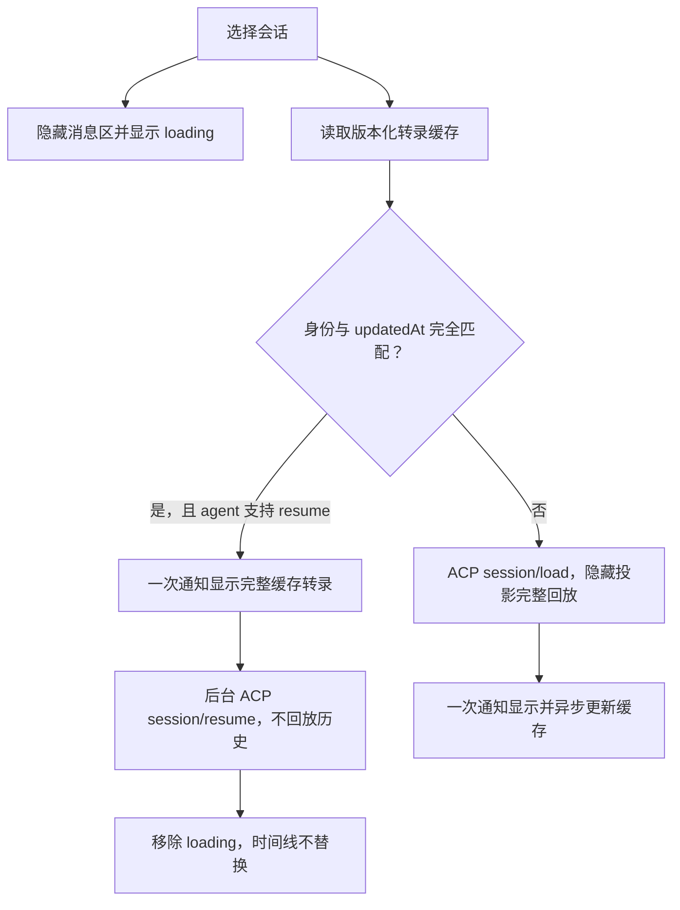

# 会话加载架构

## 范围与行为基线

本轮以 `main@db57d2c` 和真实会话“拉取最新代码并运行”为基准。此前未提交的虚拟历史窗口、占位高度、滚动触发加载、锚点恢复，以及“先显示最近消息预览”的方案均已移除。时间线继续沿用基线渲染模型。

用户可见语义只有以下几种：

1. 无缓存加载中：旧会话已经隐藏，消息区为空，只显示会话加载状态；
2. 精确版本缓存命中：一次通知显示完整缓存转录，连接状态可继续显示 loading；
3. 连接完成：移除 loading，时间线内容不发生替换。

因此不会先显示最新几条，再替换为完整会话，也不会显示正在回放的半成品历史。缓存命中时显示的是同一 `updatedAt` 对应的全部消息，而不是尾部预览。

## 性能诊断

目标 Codex rollout JSONL 约 510 MB、19,961 行，其中 104 行超过 1 MiB，最大单行约 13.9 MiB。大量 `compacted` 记录重复携带 replacement history。

旧链路耗时约 28–34 秒，但 Flutter 隐藏投影 CPU 只约 0.75 秒。主耗时发生在 Codex ACP adapter：

1. `session/load` 调用 app-server `thread/read(includeTurns:true)`；
2. app-server 读取并解析完整 rollout；
3. adapter 将完整 thread history 转换成约 5,207 个 `session/update`；
4. adapter 逐条等待 update 发出；
5. 本应用通过 stdio、Rust runtime 和 FFI 接收并投影。

结论：只优化 Flutter 列表或 FFI 轮询无法消除首次完整读取的 30 秒。真正可控的优化是减少桥接固定开销，并在会话版本未变化时避免再次请求完整历史。

## ACP 协议边界

| 能力 | 语义 | 历史回放 |
| --- | --- | --- |
| `session/load` | 从持久化状态重建会话 | 是 |
| `session/resume` | 重新连接一个已经存在的会话 | 否 |
| `session/list` | 返回会话身份和目录元数据 | 否 |

ACP 当前没有 history cursor、offset、tail window 或 limit。`session/load` 发出的 `session/update` 是完整回放流，不是可由客户端任意分页的接口。因此本应用不能在不改变 agent/app-server 协议的前提下伪造“只拉最近 50 条”。

Rust core 接收显式的 `replay_history`：

- `true` 且 agent 支持 load：调用 `session/load`；
- `false` 且 agent 支持 resume：调用 `session/resume`；
- agent 不支持 resume：回退到 `session/load`，并返回 `replayedHistory=true`；
- 两者都不支持：返回可恢复的协议错误。

最终方法语义通过 `session_restored.payload.replayedHistory` 贯穿 Rust、FFI、Dart 和指标，UI 不根据事件数量猜测是否回放了历史。

## Rust 渲染投影与 FFI 有界延迟传输

FFI ABI v9 不再把 ACP `session/update` 的通用 payload 交给 Dart
解释。Rust 将协议事件分成两类：

- `session_update`：仅保留会话生命周期、模式、配置和权限失效等小型控制状态；
- `render_update`：只包含时间线真正消费的 user、assistant、thought、tool、plan 和 turn-completed 投影。

ACP `_meta`、`annotations` 和没有 UI 消费者的 available-commands、session-info、usage
通知不会跨 FFI。Tool 投影只允许 `toolCallId/title/kind/status/content/locations/rawInput/rawOutput`；
单个 raw input/output/location 字段超过 128 KiB、content 超过 512 KiB 时由 Rust 替换为有类型的
omission，而不是先传到 Dart 再扫描丢弃。

`session/load` 的通知在 Rust 内进入 replay projector：连续 assistant text 和 thought 在约 32 KiB
处分段，user 的文本与非文本 content block 合并为一个消息，同一回合相同 tool-call id
的 update 直接覆盖到一个工具投影。投影完成后，Rust 按约 64 KiB 或最多 16 个 update
组成 `render_snapshot_chunk`。只有随后的 `session_restored` 才提交整份转录，因此分块是传输
边界，不是可见分页。后台进程恢复产生但没有前台消费者的历史回放在 Rust 内直接丢弃。

批量拉取接口保持：

```text
ianvs_acp_poll_events(runtime, max_events, max_bytes, timeout_ms)
  -> { events: [...], hasMore: bool }
```

默认每批最多 4 个事件或 128 KiB，并在 backlog 批次间保留 4 ms 的协作窗口：

- Rust queue 保持事件所有权，Dart 没有请求的事件不跨 FFI；
- 若下一事件会超过字节预算，Rust 将其留在 `pending_event`，下一批再传；
- 单个超大事件允许作为该批第一项通过，避免永远无法前进；
- `hasMore=true` 时 Dart 延迟 4 ms 再拉下一批；周期轮询不会绕过这个 delay，避免 backlog 连续占满 UI isolate；
- `hasMore=false` 时才进入正常等待，避免空轮询；
- 每批只做一次 UTF-8/JSON 边界转换，减少 FFI 调用与 JSON decoder 固定成本；
- 单个事件仍允许超过 128 KiB 以保证协议能前进；达到 128 KiB 的批次改在后台 isolate 做 JSON decode，UI isolate 只接收解码后的事件并投影。

这属于“有界、按需拉取”的传输延迟优化。它控制内存峰值和桥接调度，但不会把 ACP 完整回放变成协议分页。

## 版本化权威转录缓存

完整 `session/load` 成功后，controller 将已经按输入预算校验过的 `ChatMessage` 转录异步写入本地缓存。缓存身份由以下字段共同确定：

- agent name；
- session id；
- cwd；
- additional directories（顺序也必须相同）；
- `session/list.updatedAt`。

再次打开会话时，目录请求和缓存读取并行执行：



缓存不是最近一屏预览，也不是部分历史。它只在目录版本精确匹配且 agent 支持 resume 时使用；`updatedAt` 改变、身份不匹配、文件损坏、字段超出输入预算或 agent 不支持 resume，都会自动回退到完整 `session/load`。本应用未正式发布，因此 client 接口不保留忽略 `replayHistory` 的旧兼容路径：所有实现都必须遵守该参数。若实现最终仍报告 `replayedHistory!=false`，controller 会使恢复失败而不是混合缓存与意外回放。

缓存命中后的消息重建仍要执行角色、时间、omission 和 metadata 输入预算校验。目标缓存约 30.9 MiB，若在 UI isolate 一次完成会形成长帧。重建现在使用 4 ms 时间片：每次耗尽时间片就先归还事件循环，确认 session-operation generation 仍有效后继续；只有整份转录全部校验成功才一次安装到 `_messages`。因此“完整内容原子显示”和“加载过程可响应”同时成立。

文件缓存采用 schema version、稳定会话身份的 SHA-256 文件名、私有权限、跨进程锁和原子替换；`updatedAt` 只在文件内容中做版本校验，因此同一会话的新版本会覆盖旧文件，不会逐版本堆积。默认拒绝超过 2,000 条消息或 48 MiB 的缓存文件。JSON 编解码在 isolate 中执行。缓存读取失败不影响 ACP 正常恢复。

## 显示、隐藏与生命周期

controller 保留一个权威消息容器 `_messages`。`visibleMessages` 在无缓存且 `isSessionReplayLoading=true` 时固定返回空列表，即使 FFI 回放或其他无关状态触发 widget rebuild，也不会泄露半成品消息。只有精确版本的完整缓存安装完成后，私有可见门闩才允许 loading 期间显示整份转录。

加载顺序：

1. 生成新的 session-operation generation，使旧操作失效；
2. 清空旧会话可见状态，设置 loading 并通知 UI；
3. 等待缓存结果，命中时原子安装并显示完整转录；
4. 在缓存转录保持可见的同时执行 `session/resume`，或在空态下执行 `session/load`；
5. 回放事件只更新隐藏投影，不逐条 `notifyListeners`；
6. 收到 `session_restored` 后加载 settings；
7. 清除 loading；无缓存 load 在此时一次显示完整转录，缓存命中则不替换时间线；
8. 完整 load 成功时，在 UI 获得绘制机会后按 4 ms 时间片生成缓存快照，再交给 isolate 编码并原子写入，避免完成加载后又出现一段同步停顿。

切换会话或 dispose 后，迟到事件会被 generation 丢弃。恢复失败时，session、messages、settings、usage、commands、快照和指标作为一个事务恢复到进入前状态。

连续 assistant text delta、分片 user content 和 tool update 已在 Rust replay projector 中合并；Dart controller 不再包含 ACP replay projector，也不再识别 `_acpUserChunk` 或 `agent_message_delta` 等协议形态。Dart 只做 ChatMessage 的最终输入预算准入和原子可见状态切换。大工具详情当前没有按 tool-call id 重新读取内容的 resolver，因此在 Rust 侧执行字段级上限和 omission 投影，而不是无界跨 FFI。

## 可观测性

每次真实恢复记录 `SessionLoadMetrics`：

- `cacheReadMs`、`cacheHit`、`cacheMessages`；
- `restoreMs`；
- `firstEventMs`、`eventSpanMs`；
- `projectionMs`；
- `totalMs`；
- `replayedHistory`、`replayEvents`。

Debug 构建对超过 100 ms 的加载输出一条 `[session-load]`。验收重点不是只看总时间，还要确认缓存命中时 `replayedHistory=false`、`replayEvents=0`。

## 验收标准

自动化验收使用真实会话“拉取最新代码并运行”，覆盖：

1. 首次无缓存打开时只显示 loading，不显示最新消息或半成品历史；
2. 首次完整 load 后一次显示完整会话并写入版本化缓存；
3. 重启应用后再次打开，同一 `updatedAt` 命中缓存并走 `session/resume`；
4. 第二次从空态一次显示完整缓存转录，后台 resume 不替换时间线；
5. 缓存命中的恢复时间显著低于首次约 30 秒；
6. tool/status 展开收起、轮次导航与基线滚动行为正常；
7. `updatedAt` 改变后不会使用旧缓存，而会回退完整 load。

### 2026-08-04 真实会话验收

电脑自动化从重建后的 macOS Debug 包打开“拉取最新代码并运行”：

| 项目 | 首次无缓存 | 同版本缓存命中 |
| --- | ---: | ---: |
| 目标转录 | 825 条消息 | 825 条消息 |
| 缓存文件 | 不存在 | 30,939,722 bytes |
| 约 0.8 秒时 | 仅 loading | — |
| 约 20 秒时 | 仍仅 loading，无最新消息泄露 | — |
| 完整转录首次可见 | 约 36.7 秒 | 约 2.2 秒 |
| 显示方式 | 完整 load 后一次显示 | 完整缓存一次显示 |

缓存命中后的可见时间缩短约 94%。最终时间线没有“最新消息 → 完整历史”的替换；工具聚合组的展开与收起也通过自动化交互验收。

### 2026-08-05 ABI v9 防卡顿复验

在 Rust 64 KiB/16-update 快照和 Dart 128 KiB/4-event 拉取预算下，重新构建 macOS Debug 包并从空白界面恢复同一会话：

| 项目 | 实测 |
| --- | ---: |
| 完整缓存原子可见 | 2.23 秒 |
| 历史区向上滚动一页动作 | 85 ms |
| 加载后侧栏搜索输入 | 14 ms |
| 历史可见性 | 滚动立即出现更早消息 |

首屏只出现一次完整转录，没有先挂载最新消息预览；后台 `session/resume` 没有替换时间线。加载完成后滚动和输入均保持响应。工具组展开后显示 3 条独立工具行，单条工具继续可展开 Kind/Call ID 详情，显示/隐藏语义未因传输裁剪而退化。
