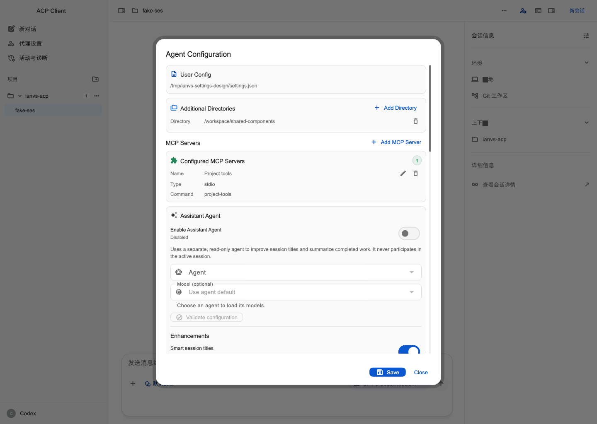
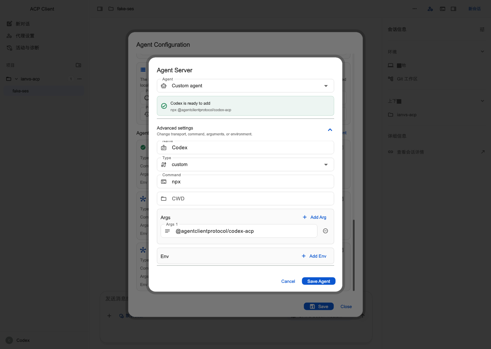
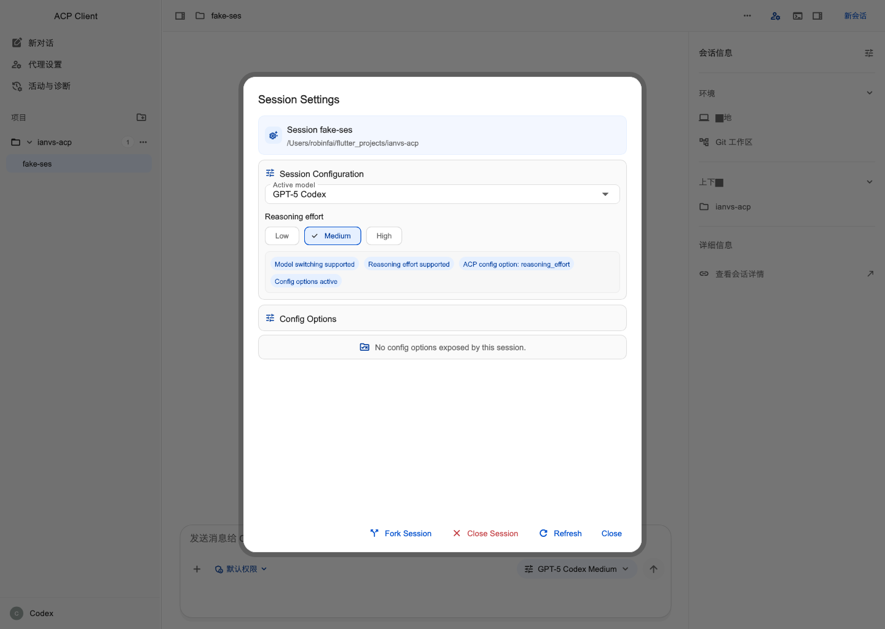

# 现状截图与问题标注

日期：2026-09-09。截图由 [capture_test.dart](capture_test.dart) 渲染当前实际 Flutter 应用组件，1440×1024、DPR 1。数据来自 [fixture.dart](fixture.dart) 的 FakeAgentClient 和隔离配置；配置写入替换为内存回调，不连接外部 Agent，也不读取用户会话。

截图并非原生桌面录屏。字体使用 Arial/Hiragino/Roboto Mono 代替系统动态字体，背景 Inspector 个别中文 glyph 缺失是采集限制，不能当成生产缺陷。Fake 暴露的 fork 能力也不能证明生产 Rust 支持 fork。Agent 示例启动配方只用于表单排版，不作为安装或兼容认证。

采集应用使用自持 Controller，保留生产配置入口的 Save。注入 Controller 的受限模式会隐藏 Save，已在截图前修正 fixture，未将该现象计为缺陷。会话设置截图通过直接打开现有组件采集，只证明内容，入口路径以代码审计为准。

复验命令：

```sh
./tool/flutter_workspace.sh test app docs/settings-redesign-2026-09-09/capture_test.dart --update-goldens
```

本轮结果：1 项通过；9 张截图生成。该脚本是设计取证工具，不是产品回归测试套件。

## 截图步骤

| 步骤 | 页面/动作 | 文件 |
| --- | --- | --- |
| S01 | 工作台准备状态 | [01-workspace.png](screenshots/before/01-workspace.png) |
| S02 | 打开 Agents 菜单 | [02-agent-menu.png](screenshots/before/02-agent-menu.png) |
| S03 | 进入 Agent Configuration 顶部 | [03-global-settings-top.png](screenshots/before/03-global-settings-top.png) |
| S04 | 滚动到 reviewer 与存储区 | [04-permissions.png](screenshots/before/04-permissions.png) |
| S05 | 滚动到底部 Agent 列表 | [05-agents-bottom.png](screenshots/before/05-agents-bottom.png) |
| S06 | 编辑 Codex | [06-agent-editor.png](screenshots/before/06-agent-editor.png) |
| S06b | 展开启动配置 | [06b-agent-editor-expanded.png](screenshots/before/06b-agent-editor-expanded.png) |
| S07 | 添加 MCP | [07-mcp-editor.png](screenshots/before/07-mcp-editor.png) |
| S08 | 当前会话设置组件 | [08-session-settings.png](screenshots/before/08-session-settings.png) |

## 标注编号与改版要求

| 编号 / 级别 | 证据位置与问题 | 用户影响 | 目标与验收 |
| --- | --- | --- | --- |
| V01 / 主要 | S03 标题 Agent Configuration；内容从配置路径、目录、MCP、Assistant 开始，Agent 在 S05 才出现 | 用户为改启动命令需滚过多组无关配置 | 设置改名，分类导航；Agent 首屏可达 |
| V02 / 主要 | S06b 内层 Save Agent 与背后外层 Save 并存；S07 同样出现 Save MCP Server | 子表单保存仅更新草稿，易误认为已持久化 | 同一设置草稿、唯一明确主 Save；若保留子步骤须叫应用到草稿 |
| V03 / 主要 | S03/S04 助手/reviewer 关闭后仍展示其依赖字段；Client Providers 标签含 FS/Outside | 配置密度高，且缺少可理解的能力和角色范围 | 按启用/来源条件渐进展开；字段使用中文完整名称与范围提示 |
| V04 / 主要 | S03/S05 页脚无脏状态、生效影响或丢弃提示；源码 `_saveConfig` 立即重建 controller | 不能判断改了什么、何时生效；保存可能影响会话 | 显式草稿状态、离开处理、真实重载说明、活动时限制 |
| V05 / 一般 | S06/S06b 正在编辑已有 Codex，却显示“ready to add”和绿色勾号 | 把配置存在/静态就绪误读为可启动或已验证 | 标为“编辑 Codex”和连接类型；校验状态仅来自实际结果 |
| V06 / 主要 | S08 参数页脚包含 Fork/Close Session，与关闭弹窗 Close 相邻 | 参数与生命周期动作混排，关闭含义不清 | 生命周期移至会话菜单；参数页注明即时应用 |
| V07 / 一般 | S08 已显示 model/reasoning，却紧接“No config options exposed”空面板和协议标签 | 空状态与已显示能力矛盾，技术细节占据主视图 | 没有额外参数时不渲染额外区；技术状态归诊断 |
| V08 / 一般 | S02 Agents 菜单同时放切换、全量设置、认证、诊断、独立 LLM | 当前连接与应用工具边界不清 | Agent 菜单聚焦连接操作，其余深链至明确归属 |

## 已打开核对的关键截图

全局设置顶部与嵌套编辑反映 V01–V05：





当前会话设置反映 V06–V07：



## 视觉之外的限制

键盘焦点、VoiceOver、真实窗口缩放、macOS 原生文件选择和配置保存错误恢复尚未在本轮验收。分析结论来自组件截图与源码，不得用生成草图或 Fake 测试替代真实 Agent 验证。没有产品采用率数据，不因此断言被下沉功能没有用户价值。
