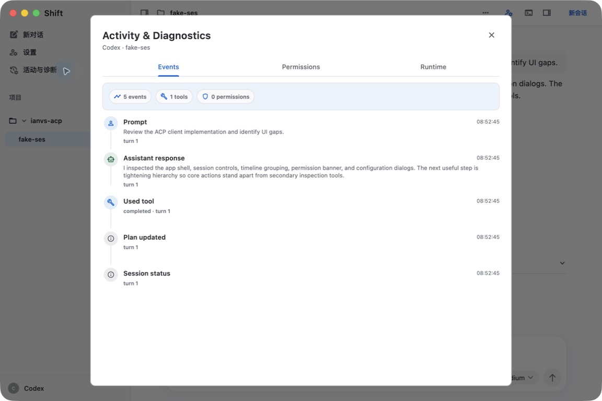
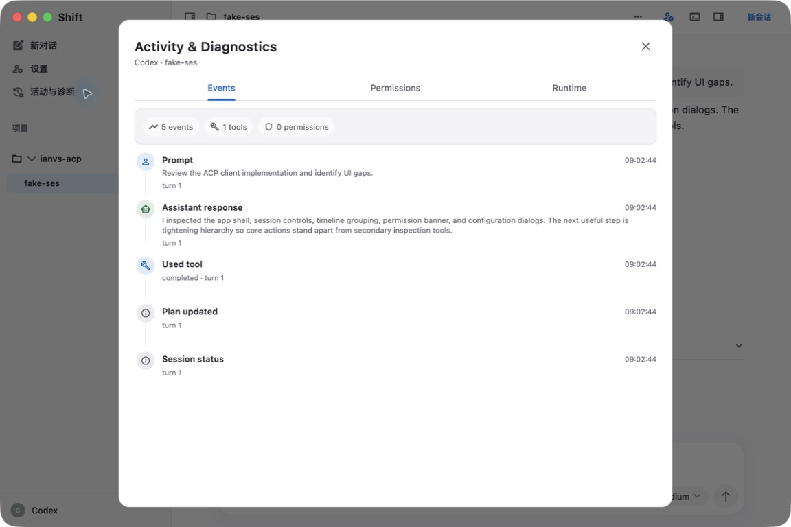
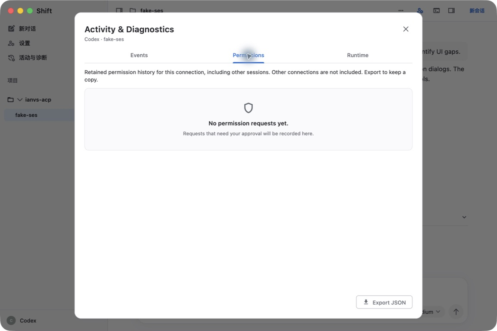
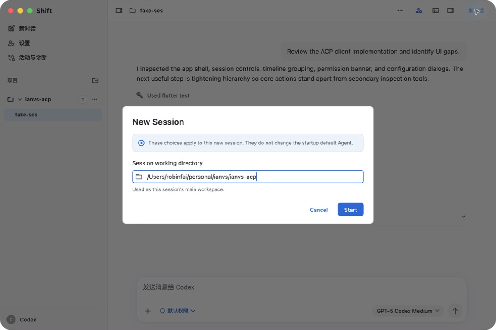
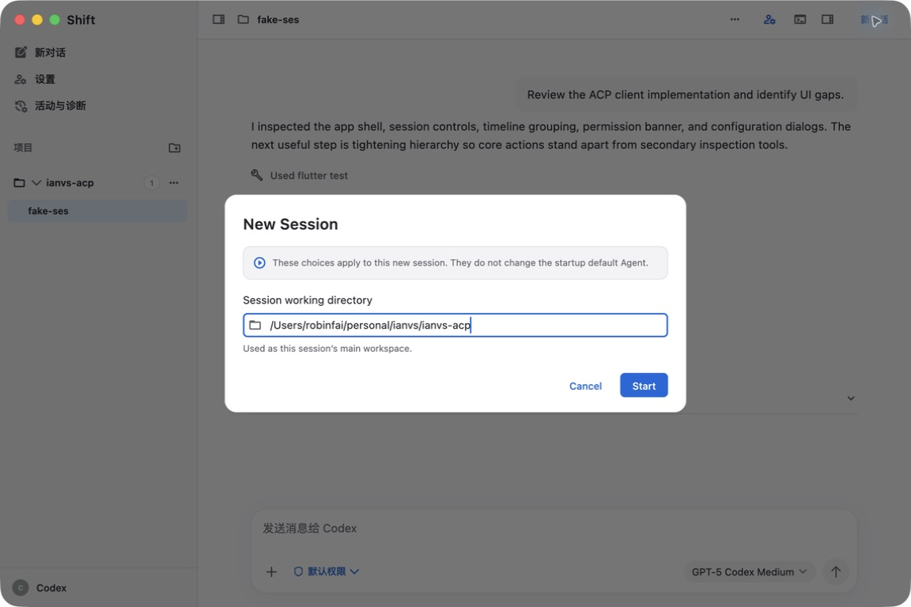

# Shift 全应用 UI 一致性复核 · 2026-09-12

沿用上一轮确认的样式：中性底色、浅细边、轻阴影、常规辅助文字、细线操作图标；保留模型滑轨粒子动画和真实键盘焦点。此次从 main `92ef86e` 开始，在当前代码上重新捕获截图，没有把旧截图当作本轮实装证据。

## 页面检查与结果

| 步骤 | 页面与状态 | 结果与处理 | 本轮证据 |
| --- | --- | --- | --- |
| 1 | 工作区、侧栏、输入区 | 布局健康。统一添加、关闭、展开操作的 Cupertino 图标；侧栏菜单统一为 16 点圆角、raised 底色及 0.75 点 separator，模型菜单、动画和拖动逻辑保持原样 | [原生工作区](after/01-workspace.png) |
| 2 | Agent、工具与目录、权限、AI 助手、本地存储设置 | 页面结构健康。减轻部分辅助文字，统一操作图标；表单边界、选中项和开关保持明确 | [原生 Agent 设置](after/06-settings.png)、[权限大字](after/light-settings-large-text.png)、[深色权限](after/dark-settings-permissions.png) |
| 3 | 诊断 Events、Permissions、Runtime | 原整块蓝色摘要与重复徽标边线过重。改中性摘要、无边线统计徽标，元数据恢复常规字重，10.5 点时间增至 11 点，卡片改 0.75 点 separator | [Events](after/02-diagnostics.png)、[权限空状态](after/03-permissions.png)、[Runtime](after/04-runtime.png)、[权限记录](after/light-permission-record.png) |
| 4 | 新会话、会话参数、详情与上下文 | 普通说明区去蓝色底，只读信息及卡片使用浅细边。原生新会话字段自动聚焦仍保留，这是可编辑输入的真实焦点 | [新会话](after/05-new-session.png)、[会话参数](after/light-session-settings.png)、[会话详情](after/light-session-details.png) |
| 5 | Agent 发现、恢复会话、目录确认、外部会话确认 | 辅助说明和边线统一。移除恢复弹窗的旧 shape 覆盖，使其继承共享弹窗外壳，选中 Agent/会话和允许/拒绝等语义反馈保留 | [发现](after/light-discovery.png)、[恢复](after/light-resume.png)、[目录确认](after/dark-workspace-review.png)、[外部会话](after/light-external-session.png) |
| 6 | 文件预览、Markdown 元数据与图片、其他菜单 | 源码检查后统一普通边线、说明字重及关闭/展开图标，相关既有 UI 测试通过；这些页面没有逐项补拍原生图，不能据此宣称所有文件格式和错误状态均已视觉验收 | `file_preview_workspace_test.dart`、`markdown_front_matter_test.dart` 等应用 UI 回归 |

## 原生前后对照

相同 1152×768 窗口；Fake 数据时间因重建而不同。

| 调整前 | 调整后 |
| --- | --- |
|  |  |
|  |  |
|  |  |

## UI 库与应用的分工

共享 Dialog/AlertDialog/IanvsDialog 由 UI 库项目独立评审、实现、验证并推送 main：[`1a3727ee77de28f5044008b485b100a62f639669`](https://github.com/robinfai/ianvs-design/commit/1a3727ee77de28f5044008b485b100a62f639669)。新增 `dialogRadius`（默认 16），弹窗外壳使用 separator 0.75 点边线、elevation 4 和轻阴影；不改变内容 Card、输入框轮廓、2 点键盘焦点或动画。库侧组件 169 项、展厅 71 项通过。

UI 库随后正式发布 [0.4.0](https://pub.dev/packages/ianvs_design/versions/0.4.0)，包含上述功能。三个工作区已改为 `ianvs_design: ^0.4.0`，移除临时 Git override，lockfile 使用 pub.dev hosted 包。普通摘要、卡片、辅助字重和操作图标属于应用，本次在应用实现。

## 验证与边界

- 应用 UI：371 项通过。最后补充移除旧样式覆盖后，恢复会话与侧栏菜单 55 项再次通过。
- 聊天包：283 项通过，2 项既有跳过；包含模型选择、滑轨动画重绘、拖动与吸附回归。
- 独立示例：2 项通过。
- 截图检查：4 项通过，36 张调整后布局截图，覆盖深浅色、600 点窄窗及 2 倍文字；没有布局异常。
- 三工作区静态、格式检查通过。
- 切换 pub.dev 0.4.0 后，三工作区依赖解析与静态检查再次通过，输入框与模型选择 71 项回归通过；锁文件校验和与发布包一致。
- 正式入口 `lib/main.dart` 的 macOS Release（Shift.app）构建、签名闭包与 bundle 检查通过。

`01–10` 为电脑工具捕获的本轮原生基线，`after/01–06` 为重点原生复核；其余带 light/dark 前缀的截图是生产组件的离屏布局复核，使用兼容字体，字体和窗口阴影以原生截图为准。设置原生预览处于只读配置模式，可编辑和保存行为由既有 UI 测试覆盖。没有发起真实 Agent/LLM 请求、修改用户配置或执行权限请求。此次是 macOS 风格一致性复核，不宣称 iOS 真机或所有媒体状态已完成验收；截图不能单独证明完整无障碍合规。

复现布局：

```sh
./tool/flutter_workspace.sh test app --reporter expanded docs/ui-consistency-2026-09-12/capture_test.dart --update-goldens --dart-define=CAPTURE_STAGE=after
```
